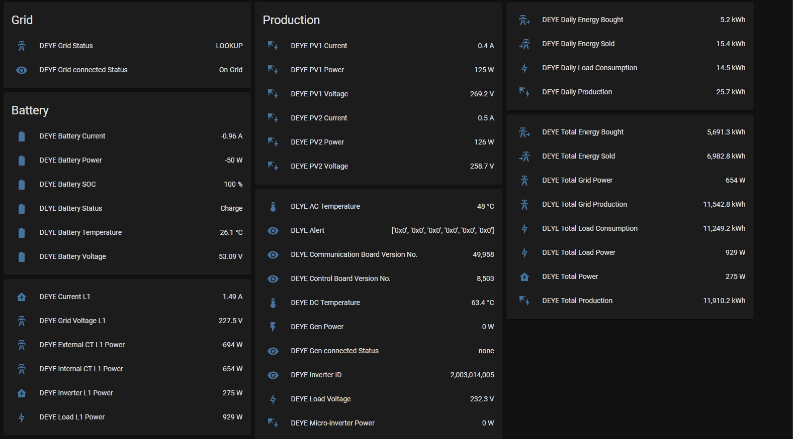

# Solarman integration
This is a Home Assistant component for interacting with Solarman data collectors used with a variety of inverters. The integration allows Home Assistant to connect in direct-mode over the local network to the collector to extract the information, and no cables are required. 

It has been tested with a 5kW DEYE/SUNSYNK inverter. The collector is reported to be used in Omnik, Hosola, Goodwe, Solax, Ginlong, Samil, Sofar and Power-One Solar inverters, you may get success from any of these as well.

This component uses version 5 of the communication protocol. If your collector is older and this component does not work, try the following integration which is similar, but uses version 4 of the protocol:

https://github.com/heinoldenhuis/home_assistant_omnik_solar


# Installation

## Manual
For this is is highly recomended to use the "Samba share" add-on (you will need to enable advanced mode in your user profile).

Clone the repo, and copy the "solarman" folder in "custom_components" to the "custom_components" folder in home assistant. 

After that, the folder structure should look as follows:

```bash
custom_components
├── solarman
│   ├── __init__.py
│   ├── const.py
│   ├── manifest.json
│   ├── parameters.yaml
│   ├── parser.py
│   ├── solarman.py
│   └── sensor.py
├── {other components}
```

Then proceed to configuration.

# Configuration

On your DHCP server, allocate a static IP for the WiFi data logger. 

In your configuration.yaml file, add the solarman platform under "sensors"


## Example:

~~~ YAML

sensors:
  - platform: solarman
    name: SUNSYNK
    inverter_host: 192.168.0.201
    inverter_port: 8899
    inverter_serial: 1720747149 
    scan_interval: 30
~~~

## Parameters 

| Parameter | Description |
| ---- | ---- |
| name | This name will be prefixed to all parameter values (change as you like)|
| inverter_host| The IP address of the data logger |
| inverter_port | Always 8899 |
| inverter_serial| The serial number of the data collector |
| scan_interval | Time in seconds between refresh intervals |

## Entities
Once the component is running, it will add the following entities to Home Assistant


## Energy Dashboard
The entities includes the device classes to enable it to be added to the [Energy Dashboard](https://www.home-assistant.io/blog/2021/08/04/home-energy-management/) introduced with Home Assistant Core 2021.8.

This will allow you to create a dashboard that looks like this:

